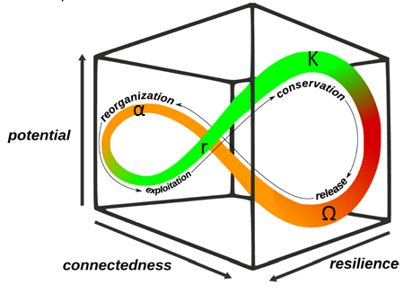

### Package QtAC (Quantifying the Adaptive Cycle)

<p align="center">
  <br>
  <a href="https://www.nature.com/articles/s41598-020-74888-y" >(zu Castell and Schrenk, 2020, Fig.1).</a>
</p>

QtAC provides tools to analyze the maturation process of complex systems in the sense of Holling's adaptive cycle metaphor ([zu Castell and Schrenk, 2020](https://www.nature.com/articles/s41598-020-74888-y)). Using time series of components' abundance data, the dynamics of information transfer among the components are estimated. On the basis of the resulting information networks, potential, connectedness, and resilience can be computed. The development of these three variables defines the system's course through the adaptive cycle. The package offers several options to visualize the results. The main function requires a transfer entropy estimator being included in the JIDT toolkit ([Lizier, 2014](https://www.frontiersin.org/articles/10.3389/frobt.2014.00011/full)). Besides, functions of the packages pracma, rJava, igraph, and rgl are used.

## ESSENTIAL SOFTWARE:
* QtAC package
* folder "dist" (it is essential to keep the folder structure since the paths in MTinfodynamics.jar are based on it) 
* java-jdk-11 (https://www.oracle.com/java/technologies/downloads/)
* R (https://cran.r-project.org/index.html)
* RStudio (optional, https://www.rstudio.com/products/rstudio/download/)
* Docker (optional, https://docs.docker.com/get-docker/)

------

## INSTALLING PROCESS

### Linux (Ubuntu 20.04.3 LTS):
   1. Install R version 3.6.3:
```console
sudo apt update
sudo apt install r-base
```
   2. Install java-jdk-11:
```console
sudo apt install openjdk-11-jdk openjdk-11-jdk-headless
```
   3. Configuring java for R:
```console
sudo R CMD javareconf
```
   4. Install mesa libraries (Optional):
```console
sudo apt install mesa-common-dev libglu1-mesa-dev
```
   5. Run RStudio and copy and paste in the internal console:
```R
install.packages("rJava")
install.packages("igraph")
install.packages("rgl")
install.packages("pracma")
install.packages("plotrix")
```
   6. Install QtAC package:
   * clone the project or download the file [QtAC_X.X.X.tar.gz](https://github.com/hannahschrenk/QtAC/blob/master/QtAC_0.1.1.tar.gz)
   * in the internal console type:
```R
getwd()
```
   * then move the QtAC_X.X.X.tar.gz to that folder
   * install QtAC:
```R
install.packages("QtAC_X.X.X.tar.gz", repos = NULL, type="source")
```

### Windows 10 Pro (64bits):
   1. Install R-4.1.2-win (https://cran.rstudio.com/bin/windows/base/R-4.1.2-win.exe)
   2. Install java jdk-11 (https://github.com/adoptium/temurin11-binaries/releases/download/jdk-11.0.13%2B8/OpenJDK11U-jdk_x64_windows_hotspot_11.0.13_8.msi)
   3. Install RStudio (recommended, https://download1.rstudio.org/desktop/windows/RStudio-2021.09.1-372.exe)
   4. Install rtools (https://cran.r-project.org/bin/windows/Rtools/rtools40v2-x86_64.exe)
   5. Run RStudio and copy and paste in the internal console:<br>
   * set the JAVA_HOME:
```R
Sys.setenv(JAVA_HOME="C:/Program Files/Java/jdk-XX.X.X/")
```
**NOTE**: Normally the jdk is installed in: C:/Program Files/Java/. If not, search for the jdk folder and copy the full path. Make sure to change “\\” to “/” in the path.<br>

   * install the packages:
```R
install.packages("rJava")
install.packages("igraph")
install.packages("pracma")
install.packages("plotrix")
install.packages("rgl")
```
   * install QtAC package:
   * clone the project or download the file [QtAC_X.X.X.tar.gz](https://github.com/hannahschrenk/QtAC/blob/master/QtAC_0.1.1.tar.gz)
```R
install.packages("C:/path_to_the_package/QtAC_X.X.X.tar.gz",repos = NULL,type="source")
```

### macOS (Monterey):
   1. Install R-4.1.2-win (https://cran.rstudio.com/bin/macosx/base/R-4.1.2.pkg)
   2. Install java jdk-11 (https://github.com/adoptium/temurin11-binaries/releases/download/jdk-11.0.13%2B8/OpenJDK11U-jdk_x64_mac_hotspot_11.0.13_8.pkg)
   3. Install XQuartz (https://github.com/XQuartz/XQuartz/releases/download/XQuartz-2.8.1/XQuartz-2.8.1.dmg)
   4. Install RStudio (recommended, https://download1.rstudio.org/desktop/macos/RStudio-2021.09.1-372.dmg)
   5. Configuring java for R:<br>
   * open a terminal and copy and paste
```console
R CMD javareconf
```
   6. Run RStudio and copy and paste in the internal console:<br>
```R
install.packages("Cairo")
install.packages("png")
install.packages("shiny")
install.packages("rJava")
install.packages("igraph")
install.packages("rgl")
install.packages("pracma")
install.packages("plotrix")
```
   7.  Install QtAC package:
   * clone the project or download the file [QtAC_X.X.X.tar.gz](https://github.com/hannahschrenk/QtAC/blob/master/QtAC_0.1.1.tar.gz)
   * install QtAC:
```R
install.packages("/path_to_the_package/QtAC_X.X.X.tar.gz", repos = NULL, type="source")
```
   * Or with RStudio go to:<br>
  Tools -> Install Packages -> select "Package Archive File (.tar.gz)" -> install

------

**NOTE**<br>
In case of error in the rgl package installation please install these packages (Win/Linux/Mac):<br>
```R
remotes::install_github(c("rstudio/webshot2", "rstudio/chromote", "r-lib/pkgdown"))
```

------

## Ready to use (Docker Optional)
These instructions will get you running the QtAC package in a Docker container.<br>
The easiest way to use the package is trough the QtAC Docker image. Follow the instructions [here](docker.md) to install Docker and run the QtAC package in your local machine.<br>

------

## SUPPLEMENTARY MATERIAL:

The QtAC folder contains a manual "QtAC_X.X.X.pdf" describing the main functions. An example application to a bacterial community can be found in the subfolder "Example". The subfolder "dist" contains the file "MTinfodynamics.jar" which is necessary to run the main function QtAC.

# QtAC Tutorial

__Example description:__<br>
We provide an example application of QtAC to a SIHUMI community (simplified human intestinal microbiota, Becker et al. 2010). It is based on time series of abundance data of seven bacterial species, which has been simulated using BacArena (Bauer et al. 2017). Each row of the tab-separated file "QtAC_SIHUMI.txt" contains the number of individuals of one of the species at 40 subsequent simulation steps. The name of the respective species is specified in the first column. Following "QtAC_SIHUMI.R", the user exemplarily learns how to estimate a series of information networks from abundance data and how to compute the corresponding systemic variables. Several ways of visualizing the results are illustrated.

__Run example:__<br>

   1. INITIALIZATION:<br>
```R
library(QtAC)

# Only for Windows: uncomment the following line and replace X with your Java version
# if a Java related error occurs
# Sys.setenv(JAVA_HOME="C:/Program Files/Java/jdk-XX.X.X/")

work_folder  <- "/path_to/some_folder/"            # Working directory. 
                                                   # For windows add C:/path_to/some_folder 
                                                   # Make sure to change “\” to “/” in the path

observ_data  <- "/path_to/Example/QtAC_SIHUMI.txt"  # File containing the example data
infodyn_path <- "/path_to/dist/MTinfodynamics.jar"  # Path of the MTinfodynamics.jar file (included in "dist")
setwd(work_folder)

num_timepoints <- 30   # length of the time windows serving as basis for the transfer entropy calculations
signfac <- 0.1         # significance level
```
   2. CALCULATIONS:<br>
```R
# load the data
Data <- QtAC.TXT.reader(observ_data, col_names = FALSE, row_names = TRUE)

# compute networks of information transfer for every time point starting from num_timepoints
result_mtx <- QtAC(Data, num_timepoints, infodyn_path, l = 10L, k = 10L, delay = 2L)

# take only information transfers passing the significance level into account
result_mtx_sig <- QtAC.signfactor(result_mtx, signfac)

# calculate the three systemic variables for every network
maturation <- QtAC.maturation(result_mtx_sig)
```
   3. VISUALIZATIONS:<br>
```R
# plot the first network of information transfers (corresponding to time point 30) and save it
QtAC.network(result_mtx_sig, num_mtx = 1, edge_label = TRUE, arrow_width = 2, layout = "nicely", save = TRUE)

# plot the development of potential, connectedness, and resilience over time and save it
QtAC.2dplot(maturation, save = TRUE)

# plot the development of potential and connectedness w.r.t. each other and save it
QtAC.2dmixplot(maturation, "potential", "connectedness", save = TRUE)

# plot a 3D plot of potential, connectedness, and resilience
QtAC.3dplot(maturation, mat_points = TRUE)
```
**NOTE**: All image files are saved in the Working directory.<br>

------

## Versioning
0.1.1

## Authors
**R package:**<br>
Hannah Schrenk, Carlos Garcia, Nico Schreiber

**Methodology:**<br>
Hannah Schrenk and Wolfgang zu Castell

## License
This project is licensed under the MIT License - see the [LICENSE.md](LICENSE.md) file for details
